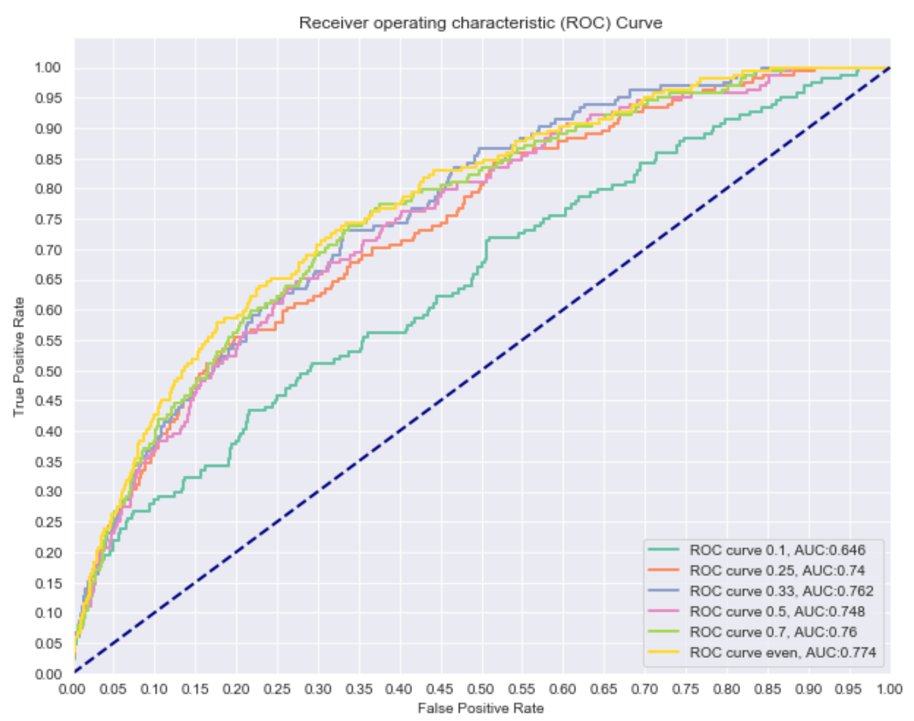
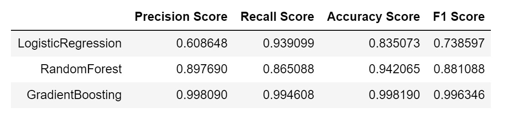
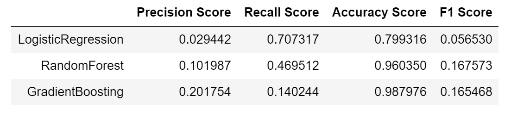
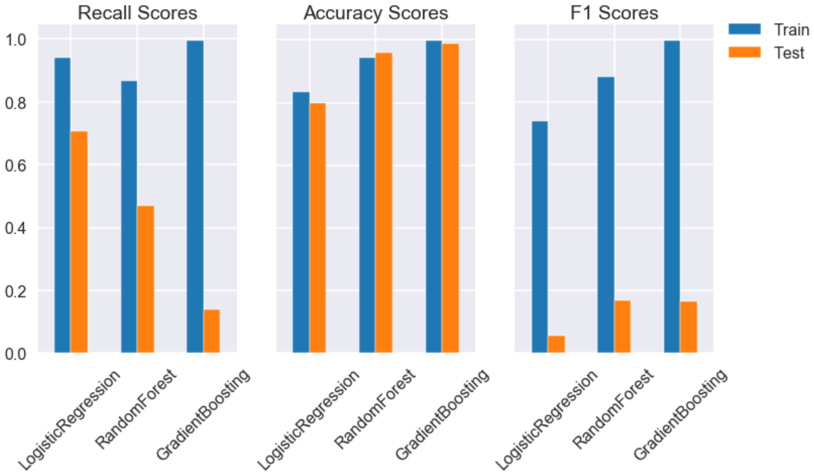
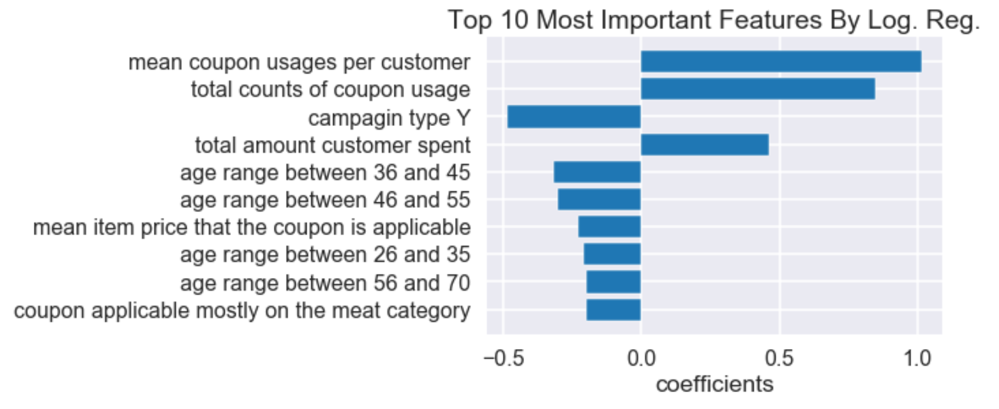
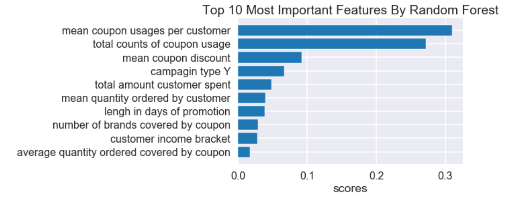
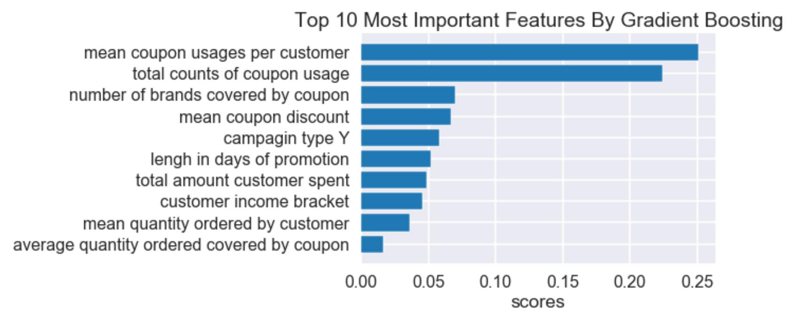

# Coupon Redemption Prediction - Machine Learning Project
## About the project
### Abstract
The coupon marketing strategy has many benefits such as attract new customers and advertising new products. Investigating how well. Investigating how well coupons are redeemed per promotional campaign is very important to measure how successful the campaign is and how it can be improved for next time. Building models using machine learning techniques can not only predict coupon redemption behaviors under different conditions but also provide insights on what influences customers to redeem a coupon. The dataset were consist of 5 different types of information as separate tables: Campaign Data, Item Data, Coupon Item Mapping, Customer Demographics, and Customer Transaction Data. The train and test sets contain each type of identification numbers from  customers, campaigns, coupons, and  the redemption status. The redemption status which was the target variable, was categorical and imbalanced therefore the SMOTE technique was applied to create synthetic data points to change the ratio of two classes from 0.0094 to 1 to 0.33 to 1 of the positive class to the negative class ratio. Extensive feature engineering process was conducted to extract integrated features from multiple tables. After processing the data, three different models were built and tuned using the logistic regression, the random forest, and the gradient boosting algorithms. All three models had over 80% accuracy although their hyperparameters were tuned based on the recall scores. From the insights from the three models suggest that (1) Find ways to cultivate and maintain loyal  customers such as a reward program; (2)Increase the scale of type X campaign which is one of two types like distribute more and variety of coupons during type X campaign; (3) Use promotions with widely applicable coupons over different brands. 
### About the dataset
The dataset that was used for this project was taken from [*kaggle*](https://www.kaggle.com/vasudeva009/predicting-coupon-redemption). The original goal of this dataset was to build a model and train it with the last 18 campaigns and predict the coupon redemption for the next 10 campaigns. However, I only used the train dataset with the 18 campaigns by splitting  it into the train and the test data to get evaluation scores for the test set. The main purpose of this project was to get the insights of what features influence customers to redeem coupons. The following schematic diagram from the kaggle site describe the relationships between the given 6 tables in the dataset. 

The customers receive coupons during various campaigns though outlets like emails. The customers can redeem the given coupon for any valid items described in the *Coupon Item Mapping* within the duration between `start_date` and `end_date` in the *Campaign Data*. The *Customer Transaction Data* table saves the amount of discount by the coupon redemption or by other type of discounts and the *Train* (which is the train and the test sets for this project) saves the `coupon_id` and the `redemption_status`.  

### Jupyter notebook files
There are two Jupyter notebooks:
* __Data_understanding_preparation__ contains the business understanding, the exploratory data analysis (EDA), and the data preparation. Two main issues were needed to be addressed to get the dataset ready to build models. 

    1. Feature engineering: As shown in the diagram, the *Customer Transaction Data* does not have its own identification numbers as a column. So, it cannot be merged with the train data without some modification and by aggregations by the features shared with other tables, more information can be found. `pandas.pivot_table` and `pandas.merge` were repeatedly used for this process. 
    2. Resampling process for the class imbalance problem: The ratio of the positive class to the negative class in the `redemption status` was 0.0094 to 1. Therefore the SMOTE (Synthetic Minority Oversampling Technique) resampling method was implemented on the train data after the original train data split into the train and the test data. With varied ratios of two classes, ROC curves were plotted using the test data prediction by the logistic regression model and the least addition of synthetic positive class data with the best fit picked which was the ratio of 0.33 to 1.

* __Modeling_Evaluation_Analysis__ contains processes of building three models using logistic regression, random forest, gradient boosting methods and analyzing results from models. 

    1. The algorithms for building models were chosen as their distinct ways for models to be trained and all three provides feature importances for analyzing results. 
    2. The models were tuned based on the recall scores as the most important thing for modeling for this project is to detect as much positive classes as possible. 
    3. The optimally tuned model evaluation results for the three models are following. For our purpose, the logistic regression model would be the best as has the highest recall scores. However, the random forest model seems well balanced between other evaluation scores such as the accuracy being over 90% and a high F1 score. All three model do not seem to be overfitted by comparing the accuracy scores between predictions between the train and the test data. 
    4. The feature importances calculated by three models are helpful to investigate what factors influence customers use or not to use a coupon.

   

     

    
#### For in depth explanation about the project in less technical perspective and suggestions from the result please refer to [the blog article](link)

# How to use the codes
### List of libraries to be imported
Each Jupyter notebook starts with importing packages and you should have all of them installed. 
### Pickled dictionaries 
* In `Data_understanding_preparation`:
    1. `tables.p`: Pickled dictionary that contains preprocessed data sets before and after each step of the feature engineering process.
    2. `finals.p`: Pickled dictionary that contains the data sets at each step of the data preparation process after the feature engineering is done. 
    > Note that they are imported in `Modeling_Evaluation_Analysis`
    
* In `Modeling_Evaluation_Analysis`:
    1. `Results.p`: Pickled dictionary that contains different types of things:
        - Objects of class `result` 
        - A DataFrame that includes evaluation scores of three models
        - Collection of hyperparameters tuning results (parameter values and corresponding evaluation scores)
        - Dataframes of the feature importance from each model.
    
    Note that the `result` class definition should be run before load/dump the pickle file `Results.p`
